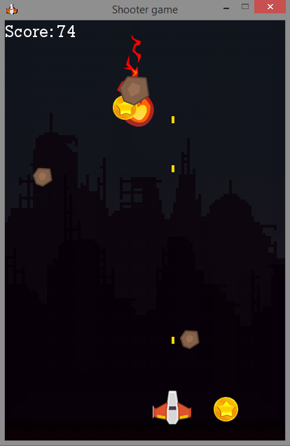

# ShooterGame
Igrač treba pucati na neprijatelje koji ga napadaju. Uništavanjem neprijatelja skuplja bodove. Neprijatelji su različiti pa vrijede različit broj bodova. Neke neprijatelje treba nekoliko puta upucati da ih se uništi. Ne smije se propustiti nijedan neprijatelj jer će igra onda završiti. Igrač povremeno dobiva nagradu kojom povećava broj bodova.

## Alati
- Python, Pygame

## Dijelovi igrice
- Poruka dobrodošlice s uputama
- Igrica
- Praćenje rezultata
- Pauziranje igrice
- Poruka o kraju igre i mogućnost ponovnog igranja ili izlaska iz igre

## Značajke igrice
- Igrica se igra preko računalne tipkovnice
- Neprijatelji su različitih veličina. Manji neprijatelji nose više bodova.
- Veći neprijatelji brže padaju
- Povremeno se pojavi veliki neprijatelj kojeg treba nekoliko puta upucati
- Povremeno se pojavi nagradni novčić kojim se poveća rezultat
- Svi događaji su popraćeni zvukovima
- Uključen je pozadinski zvuk

